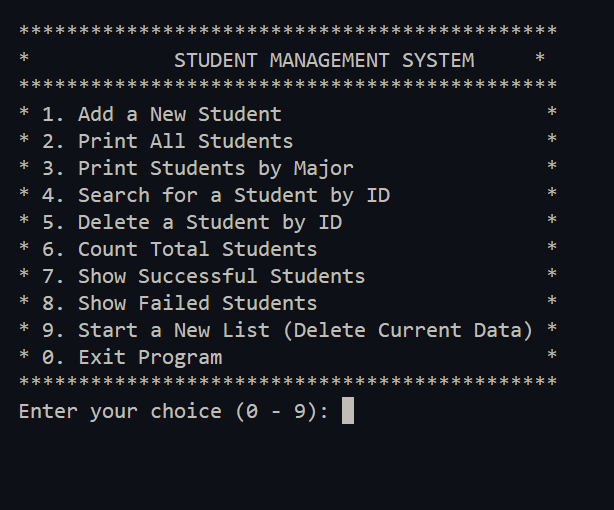
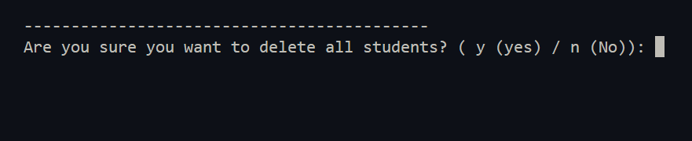
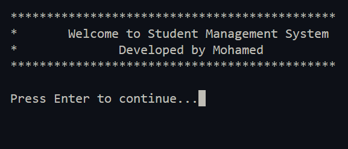

# Student Management System (C)

========================================  
**A console-based Student Management System written in C.**  
This program allows the user to manage student records, store them in a text file, and perform various operations.  
It demonstrates structured programming, file handling, and modular programming using functions.

---

## [1] Student Structure

Each student record uses the following structure:

```c
typedef struct
{
    char Fname[100], Lname[100];
    int Age, Id;
    float Mark[3], Average;
} Student;
```

**Fields Explanation:**  
- `Fname` / `Lname` → First and Last Name  
- `Age` → Student's age  
- `Id` → Unique student ID  
- `Mark[3]` → Marks for 3 subjects  
- `Average` → Average of the marks

---

## [2] Menu / Program Order

The program displays this menu:

```
*********************************************
*            STUDENT MANAGEMENT SYSTEM     *
*********************************************
* 1. Add a New Student                      *
* 2. Print All Students                     *
* 3. Print Students by Major                *
* 4. Search for a Student by ID             *
* 5. Delete a Student by ID                 *
* 6. Count Total Students                   *
* 7. Show Successful Students               *
* 8. Show Failed Students                   *
* 9. Start a New List (Delete Current Data) *
* 0. Exit Program                           *
```

Each option performs the corresponding operation on the student records.

---

## [3] Features

- Add a new student with full details  
- Display all students  
- Print students by major  
- Search for a student using ID  
- Delete a student using ID  
- Count total students  
- Display successful students (based on marks)  
- Display failed students  
- Start a new list (delete all current data)  
- Exit the program

---

## [4] Programming Concepts

This project demonstrates:

- Structures (`struct`)  
- File handling (`fopen`, `fscanf`, `fprintf`, `fgets`)  
- Functions and modular programming  
- String handling  
- Menu-driven console application

---

## [5] Data Storage

Student data is stored in:

```
Bankey.txt
```

- Each record contains the student's information (name, age, ID, marks, average).  
- The program reads and writes data to maintain permanent storage.

---

## [6] Project Structure

```
StudentManagment/
│
├── main.c        // main program with menu
├── Student.h     // struct and function declarations
├── Student.c     // implementation of student functions
├── Bankey.txt    // data file storing student records
├── images/       // folder for screenshots of program output
└── README.md     // project description
```

---

## [7] Compilation

### On Windows (GCC / MinGW)
To compile:

```
gcc main.c Student.c -o Student.exe -mconsole
```

### On Linux / Mac
To compile:

```
gcc main.c Student.c -o student_system
```

---

## [8] Running the Program

### On Windows

```
.\Student.exe
```

### On Linux / Mac

```
./student_system
```

The program displays the menu where you can choose the operations.

---

## [9] Example Output (Screenshots)

1. **Program Menu**



2. **Confirm Deletion**



3. **Program Start**



> Make sure all images are placed inside the `images/` folder in your project.

---

## [10] Purpose

This project was developed to practice:

- File-based data storage  
- Struct-based data modeling  
- Writing modular and clean C code  
- Creating menu-driven console applications

It is suitable for beginner students learning **C programming**.

---

## [11] Author

**Mohamed Elhadi**  
GitHub: [https://github.com/Elhadi-coder](https://github.com/Elhadi-coder)

---

## [12] Future Improvements

- Add input validation  
- Implement sorting functionality  
- Use dynamic memory allocation  
- Optional: Add a graphical interface

========================================
